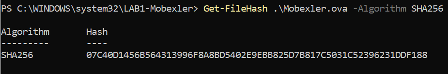
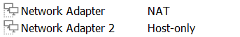
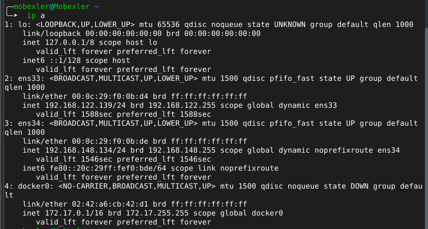
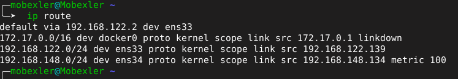
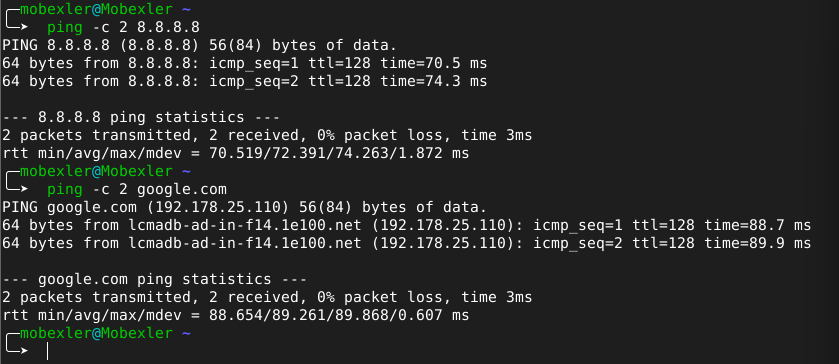
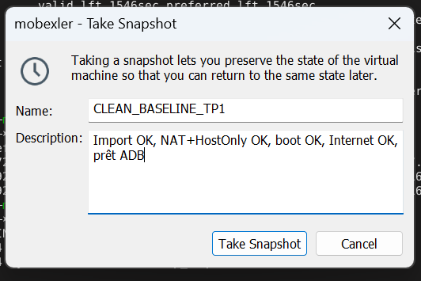
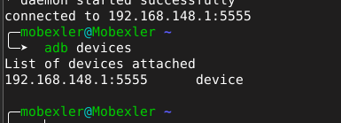

# LAB 1 : Mise en place du lab Mobexler + snapshot clean

## 1. Contexte du lab

Ce lab a pour objectif de préparer un environnement de test pour la sécurité des applications mobiles.  
L’environnement utilisé repose sur une machine virtuelle **Mobexler** exécutée avec **VMware Workstation**.

La VM est configurée avec deux interfaces réseau :

- **NAT** : pour permettre à Mobexler d’accéder à Internet.
- **Host-only** : pour permettre la communication entre Mobexler et la cible Android dans un réseau de laboratoire isolé.

À la fin du lab, l’environnement doit être stable, connecté à Internet, capable de communiquer avec une cible Android via ADB, et sauvegardé avec un snapshot propre.

---

## 2. Objectifs pédagogiques

Les objectifs de ce lab sont :

- Télécharger et vérifier l’image OVA de Mobexler.
- Importer Mobexler dans VMware.
- Configurer les interfaces réseau NAT et Host-only.
- Vérifier les adresses IP de la VM.
- Vérifier la route par défaut.
- Tester l’accès Internet et la résolution DNS.
- Connecter une cible Android avec ADB.
- Créer un snapshot propre nommé `CLEAN_BASELINE_TP1`.

---

## 3. Environnement utilisé

| Élément | Valeur |
|---|---|
| Hyperviseur | VMware Workstation |
| VM utilisée | Mobexler |
| Système hôte | Windows |
| Cible Android | Émulateur Android Studio |
| Connexion Android | ADB réseau via `192.168.148.1:5555` |
| Interface NAT Mobexler | `ens33` |
| Interface Host-only Mobexler | `ens34` |

---

## 4. Vérification du fichier Mobexler OVA

Après le téléchargement du fichier `Mobexler.ova`, une vérification SHA256 a été réalisée avec PowerShell.

Commande utilisée :

```powershell
Get-FileHash .\Mobexler.ova -Algorithm SHA256
```

Hash obtenu :

```text
07C40D1456B564313996F8A8BD5402E9EBB825D7B817C5031C52396231DDF188
```

Cette étape permet de garder une trace de l’image utilisée et de vérifier que le fichier n’a pas été modifié ou corrompu.

### Preuve



---

## 5. Configuration réseau dans VMware

La VM Mobexler a été configurée avec deux adaptateurs réseau.

| Adaptateur | Mode | Rôle |
|---|---|---|
| Network Adapter | NAT | Accès Internet |
| Network Adapter 2 | Host-only | Réseau de laboratoire |

Le mode **NAT** permet à Mobexler de sortir vers Internet à travers la machine hôte.  
Le mode **Host-only** permet à Mobexler de communiquer avec la machine hôte Windows et la cible Android dans un réseau isolé.

### Preuve



---

## 6. Vérification des interfaces réseau

La commande suivante a été exécutée dans Mobexler :

```bash
ip a
```

Résultat observé :

| Interface | Adresse IP | Rôle |
|---|---|---|
| `ens33` | `192.168.122.139/24` | NAT / Internet |
| `ens34` | `192.168.148.134/24` | Host-only / lab |
| `docker0` | `172.17.0.1/16` | Interface Docker locale |

L’interface `ens33` correspond au réseau NAT VMware, tandis que `ens34` correspond au réseau Host-only.

### Preuve



---

## 7. Vérification de la route par défaut

La commande suivante a été exécutée :

```bash
ip route
```

Résultat important :

```text
default via 192.168.122.2 dev ens33
```

Cette ligne montre que la route par défaut passe par l’interface `ens33`, donc par le réseau NAT.  
Cela confirme que Mobexler utilise correctement NAT pour accéder à Internet.

### Preuve



---

## 8. Test de connectivité Internet

Deux tests ont été réalisés.

### Test avec une adresse IP

```bash
ping -c 2 8.8.8.8
```

Ce test permet de vérifier que Mobexler peut accéder à Internet sans dépendre du DNS.

### Test avec un nom de domaine

```bash
ping -c 2 google.com
```

Ce test permet de vérifier que la résolution DNS fonctionne correctement.

Résultat obtenu :

```text
2 packets transmitted, 2 received, 0% packet loss
```

Les deux tests sont réussis, ce qui confirme que Mobexler dispose d’un accès Internet fonctionnel avec une résolution DNS correcte.

### Preuve



---

## 9. Création du snapshot CLEAN

Après validation de la configuration réseau et de l’accès Internet, un snapshot propre a été préparé dans VMware.

Nom du snapshot :

```text
CLEAN_BASELINE_TP1
```

Description utilisée :

```text
Import OK, NAT+HostOnly OK, boot OK, Internet OK, prêt ADB
```

Ce snapshot permet de revenir à un état propre avant les prochains labs, surtout si des modifications sont effectuées sur le système, le proxy, les certificats ou les outils.

### Preuve



---

## 10. Connexion de la cible Android avec ADB

La cible Android utilisée est un **émulateur Android Studio exécuté sur Windows**.

Comme il ne s’agit pas d’un téléphone USB physique, l’émulateur n’apparaît pas dans :

```text
VMware → Removable Devices
```

La communication avec Mobexler a donc été réalisée via ADB réseau.

L’émulateur a été exposé sur le réseau Host-only à travers l’adresse :

```text
192.168.148.1:5555
```

Dans Mobexler, la connexion ADB a été effectuée avec :

```bash
adb connect 192.168.148.1:5555
```

Puis la vérification a été faite avec :

```bash
adb devices
```

Résultat obtenu :

```text
List of devices attached
192.168.148.1:5555    device
```

Cela confirme que Mobexler communique correctement avec la cible Android.

### Preuve



---

## 11. Résultats obtenus

| Élément vérifié | Résultat |
|---|---|
| Fichier OVA téléchargé | OK |
| Hash SHA256 calculé | OK |
| VM Mobexler importée dans VMware | OK |
| Network Adapter configuré en NAT | OK |
| Network Adapter 2 configuré en Host-only | OK |
| Interface NAT détectée | OK |
| Interface Host-only détectée | OK |
| Route par défaut via NAT | OK |
| Ping vers `8.8.8.8` | OK |
| Ping vers `google.com` | OK |
| Résolution DNS | OK |
| Connexion ADB à la cible Android | OK |
| Snapshot CLEAN préparé | OK |

---

## 12. Problèmes rencontrés et corrections

### Problème 1 : absence de route Internet

Au début, Mobexler ne pouvait pas accéder à Internet car la route par défaut n’était pas correctement configurée.  
La route correcte doit passer par l’interface NAT `ens33`.

Résultat final correct :

```text
default via 192.168.122.2 dev ens33
```

---

### Problème 2 : DNS non fonctionnel

Le ping vers une adresse IP fonctionnait, mais le ping vers `google.com` affichait une erreur de résolution de nom.  
Le problème venait du DNS. Après correction, le ping vers `google.com` fonctionne.

---

### Problème 3 : émulateur Android non visible dans VMware

L’émulateur Android Studio n’est pas un périphérique USB physique.  
Il n’apparaît donc pas dans le menu :

```text
VMware → Removable Devices
```

La solution utilisée est la connexion ADB réseau via :

```bash
adb connect 192.168.148.1:5555
```

---

### Problème 4 : différence de version ADB

La commande utilisant le serveur ADB Windows sur le port `5037` a provoqué un conflit de versions entre l’ADB Windows et l’ADB installé dans Mobexler.

La solution retenue a été d’utiliser directement le port `5555` de l’émulateur :

```bash
adb connect 192.168.148.1:5555
```

Cette méthode a permis d’obtenir une connexion stable.

---

## 13. Conclusion

Ce lab a permis de mettre en place un environnement Mobexler fonctionnel sous VMware pour les futurs travaux de sécurité mobile.

La VM dispose maintenant :

- d’un accès Internet via NAT ;
- d’un réseau Host-only pour le laboratoire ;
- d’une route par défaut correcte ;
- d’une résolution DNS fonctionnelle ;
- d’une connexion ADB opérationnelle avec l’émulateur Android ;
- d’un snapshot propre nommé `CLEAN_BASELINE_TP1`.

L’environnement est donc prêt pour les prochains labs de sécurité mobile.

---

## 14. Captures utilisées

| Capture | Description |
|---|---|
| `lab1/01-hash.png` | Vérification SHA256 du fichier Mobexler OVA |
| `lab1/02-network-nat-hostonly.png` | Configuration VMware avec NAT et Host-only |
| `lab1/03-ip-a.png` | Interfaces réseau de Mobexler |
| `lab1/04-iproute.png` | Route par défaut via NAT |
| `lab1/05-ping-internet.png` | Test Internet et DNS |
| `lab1/06-snapshot-clean.png` | Snapshot CLEAN_BASELINE_TP1 |
| `lab1/07-adb-devices.png` | Connexion ADB avec la cible Android |
